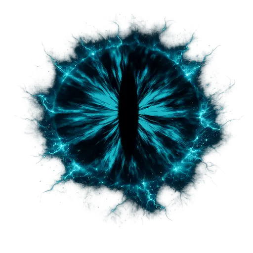

# Aegis-Scryer
<p align="center">
  
</p>


An emotion-reactive magic mirror for the web browser. A procedural, fractal
eye watches the user through their webcam, reads their facial emotion, gaze,
and gestures in real time, and speaks back as a poetic oracle powered by an
LLM. The visual state of the mirror Cyan-blue palettes, fractal geometry,
particle systems, the eye itself, and a kaleidoscopic Julia-set fractal
are driven continuously by the user's emotional telemetry.

All perception runs client-side. No video or audio ever leaves the browser.
The only data transmitted to the (self-hosted) backend is the transcribed
text of what the user says, plus a small vector of telemetry numbers.

## Features

- Kaleidoscopic Julia-set fractal renderer (WebGL) with a temporal feedback
  loop: each frame re-ingests a warped, rotated, hue-shifted copy of the
  previous frame, producing living psychedelic trails.
- A procedural eye that follows the user's gaze, blinks when the user
  blinks, dilates with rising entropy, pulses with the amplitude of its own
  voice, and retreats when the user pushes an open palm toward the camera.
- Emotion-driven visuals: anger summons fire and rising embers, sadness
  brings falling snow and cold palettes, surprise blooms the kaleidoscope
  into petals, joy turns the palette gold.
- Hand interaction via 21-keypoint tracking: fingertip light painting
  (trail color follows the current emotion), pinch-to-drag the fractal
  space, open-palm push, and a two-hand "portal" zoom gesture.
- A conversational oracle: push-to-talk speech input, LLM-generated replies
  in character, spoken aloud with subtitles, in English, Spanish, or French.
- The oracle sees as well as hears: emotional telemetry is injected into
  every LLM turn, so it can notice when the user's words and face disagree,
  or when the user avoids looking at it.

## Architecture

```
                        BROWSER (all perception is local)
+---------------------------------------------------------------------+
|  Webcam --> MediaPipe FaceMesh (468 lm + iris)  --+                 |
|         --> MediaPipe Hands (21 kp x 2)          |                 |
|         --> EmotiEffLib EfficientNet-B0 (ONNX,   |                 |
|             8-class emotion @ ~2.5 Hz)           v                 |
|                                        Telemetry fusion            |
|                                        + Entropy Engine            |
|                                                  |                 |
|  Microphone --> Web Speech API (STT) --> text    |                 |
|                                                  v                 |
|  WebGL fractal + procedural eye  <---- state (EMA-smoothed)        |
+-----------------------------|---------------------------------------+
                              | JSON: { text, telemetry, history, lang }
                              v
                    FASTAPI BACKEND (self-hosted)
+---------------------------------------------------------------------+
|  POST /api/v1/oracle  -> OpenAI gpt-4o-mini (oracle persona)        |
|  POST /api/v1/speak   -> Piper TTS (local CPU, per-sentence WAV)    |
+---------------------------------------------------------------------+
```

The backend is stateless: the browser owns the conversation history and
sends the recent turns with every request. Nothing is persisted server-side.

### Telemetry

Emotion is estimated from two fused signals: fast geometric heuristics
computed per frame from FaceMesh landmarks (brow compression, mouth corner
elevation, eye openness, calibrated against a per-session neutral baseline),
and a neural anchor from EmotiEffLib (EfficientNet-B0, 8 classes: Anger,
Contempt, Disgust, Fear, Happiness, Neutral, Sadness, Surprise) running at
about 2.5 Hz on face crops. The Entropy Engine combines motion variance
over a rolling window with the Shannon entropy of the neural emotion
distribution into a single 0..1 chaos index that deepens the fractal,
amplifies the feedback loop, and dilates the eye. An eye-contact tracker
measures what fraction of the last ~8 seconds the user's gaze rested on
the mirror.

A telemetry snapshot is captured at the moment the user finishes speaking
and rides inside the user turn sent to the LLM:

```json
{
  "text": "hello mirror",
  "telemetry": {
    "anger": 0.02, "sadness": 0.61, "surprise": 0.05, "joy": 0.08,
    "fear": 0.03, "entropy": 0.34,
    "dominant_state": "sadness",
    "gaze_behavior": "avoiding",
    "eye_contact": 0.12,
    "face_present": true
  },
  "history": [],
  "lang": "en"
}
```

The system prompt instructs the oracle to weave what it sees into what it
hears without ever citing numbers, and includes a hard guardrail: if the
user expresses genuine distress, the oracle drops the cryptic persona and
gently redirects them toward real human support.

### Voice pipeline

Speech-to-text uses the browser's Web Speech API (push-to-talk: hold SPACE
or the on-screen sigil), configured per language (en-US, es-CO, fr-FR).
Text-to-speech runs on the backend with Piper (local CPU inference, no
per-request cost): the oracle's reply is split into sentences, each
synthesized as a WAV and streamed to the browser in a playback queue, so
speech begins after the first sentence rather than after the full reply.
Subtitles render as soon as the LLM responds. During playback, an
AnalyserNode feeds the speech amplitude to the shader so the eye burns in
rhythm with its own voice. Synthesis is serialized behind a semaphore,
LRU-cached per sentence, and tuned with length_scale 1.15 for an unhurried
oracle cadence.

## Models

Model binaries are not committed to the repository. Download them into
`models/` at the project root (the frontend reaches them through the
`frontend/models` symlink).

| File | Purpose | Source |
|------|---------|--------|
| emotieff_b0.onnx | 8-class facial emotion (112x112 input) | EmotiEffLib (EfficientNet-B0 export) |
| en_US-ryan-medium.onnx + .json | English oracle voice | huggingface.co/rhasspy/piper-voices |
| es_ES-davefx-medium.onnx + .json | Spanish oracle voice | huggingface.co/rhasspy/piper-voices |
| fr_FR-tom-medium.onnx + .json | French oracle voice | huggingface.co/rhasspy/piper-voices |

MediaPipe FaceMesh and Hands assets are vendored under `frontend/logic/`.

## Getting started

Requirements: Python 3.11+, Node.js 18+, a webcam and microphone, and a
Chromium-based browser (the Web Speech API is Chrome/Edge only).

```bash
git clone git@github.com:BryanBeauDev/aegis-scryer.git
cd aegis-scryer

# 1. Backend
python3 -m venv scryer
source scryer/bin/activate
pip install -r requirements.txt

# 2. Secrets: create .env in the project root
cat > .env << 'EOF'
OPENAI_API_KEY=sk-your-key-here
OPENAI_MODEL=gpt-4o-mini
CORS_ORIGINS=http://localhost:3000
RATE_LIMIT=10/minute
EOF

# 3. Models: place the files listed above into models/

# 4. Run the oracle backend
uvicorn app.main:app --host 0.0.0.0 --port 8001

# 5. Frontend (separate terminal)
cd frontend
npm install
npm start          # serves on http://localhost:3000
```

Open http://localhost:3000, grant camera and microphone access, press
"WAKE THE EYE", hold still for the two-second neutral-face calibration,
then hold SPACE and speak to the mirror.

Smoke-test the backend without the frontend:

```bash
curl -X POST http://localhost:8001/api/v1/oracle \
  -H "Content-Type: application/json" \
  -d '{"text": "hello mirror", "telemetry": {"sadness": 0.7, "entropy": 0.4, "dominant_state": "sadness", "gaze_behavior": "avoiding"}, "lang": "en"}'
```

## Privacy model

The camera and microphone streams are consumed exclusively by models
running inside the browser (MediaPipe, EmotiEffLib, Web Speech API). The
backend receives only: the transcribed text of what the user chose to say,
a vector of ten telemetry numbers, the recent conversation turns, and a
language code. The backend stores nothing. The OpenAI API receives the
text and telemetry as part of the oracle prompt, subject to OpenAI's data
policies; no biometric media is ever transmitted by this application.

## Project status

Functionally complete as v5: fractal renderer, procedural eye, hand
interaction, neural emotion fusion, eye-contact awareness, and a trilingual
speaking oracle. Planned next: a second view ("Soul Mirror") reviving the
original v1 full-screen emotional fractal, frontend SPA restructuring, and
deployment of the backend to shared Aegis infrastructure on EC2.